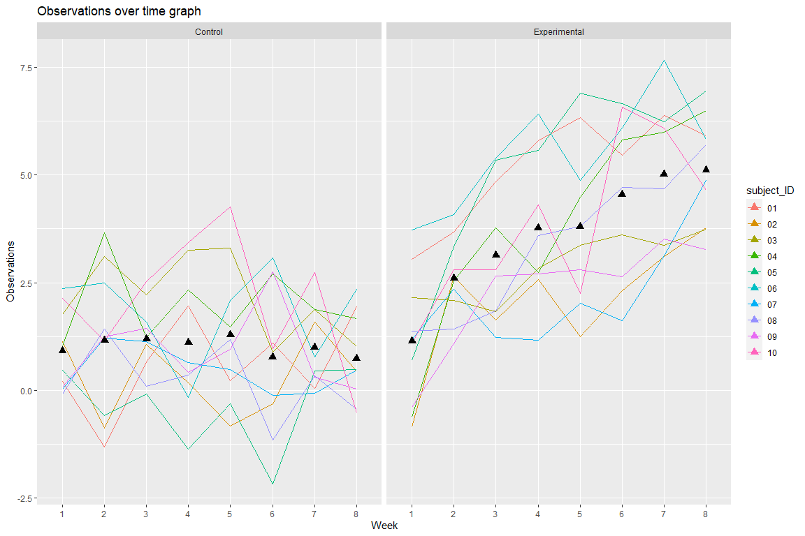

Homework 5
================
Chee Kay Cheong

# Problem 1

Create a list to read and store all the csv files located in the *Data*
folder.

``` r
# I first create a directory that contains the path to all the csv files stored in the Data folder.
Data = "C:/Users/Chu Chu/Desktop/R/Homework/HW5/Data/"

# Then I create a list that will contain all the csv file from the Data folder.
study_list = 
  Data %>% 
  # The "dir_ls" function returns filenames as a named fs_path character vector. 
  # The names are equivalent to the values, which is useful for passing onto functions like purrr::map_df().
  dir_ls() %>% 
  map(
    # Then, map a function that will read csv files.
    .f = function(path) {
      read_csv(path)
    }
  )
```

Create a single dataframe that combines all data in each csv files.

``` r
# I create a dataframe that read the list of csv files and bind all the rows into one dataframe.
long_study = 
  study_list %>% 
  # "set_names" allows R to show all the columns and values from the list of csv files.
  set_names(dir_ls(Data)) %>% 
  # Then, bind all of them together to make one tidy dataframe.
  bind_rows(.id = "file_path") %>% 
  # Create two variables "arm" & "subject_ID" for each observation.
  mutate(
    arm = str_replace(file_path, "^C:/Users/Chu Chu/Desktop/R/Homework/HW5/Data/", ""),
    arm = str_replace(arm, ".csv$", "")) %>% 
    separate(arm, c('arm', 'subject_ID')) %>% 
  select(arm, subject_ID, week_1:week_8, -file_path) %>% 
  # pivot_longer so we can do some analysis later
  pivot_longer(
    week_1:week_8,
    names_to = "week",
    values_to = "observations",
    names_prefix = "week_")

long_study
```

    ## # A tibble: 160 × 4
    ##    arm   subject_ID week  observations
    ##    <chr> <chr>      <chr>        <dbl>
    ##  1 con   01         1             0.2 
    ##  2 con   01         2            -1.31
    ##  3 con   01         3             0.66
    ##  4 con   01         4             1.96
    ##  5 con   01         5             0.23
    ##  6 con   01         6             1.09
    ##  7 con   01         7             0.05
    ##  8 con   01         8             1.94
    ##  9 con   02         1             1.13
    ## 10 con   02         2            -0.88
    ## # … with 150 more rows

``` r
long_study %>% 
  group_by(arm, subject_ID) %>% 
  summarize(
    n_obs = n())
```

    ## # A tibble: 20 × 3
    ## # Groups:   arm [2]
    ##    arm   subject_ID n_obs
    ##    <chr> <chr>      <int>
    ##  1 con   01             8
    ##  2 con   02             8
    ##  3 con   03             8
    ##  4 con   04             8
    ##  5 con   05             8
    ##  6 con   06             8
    ##  7 con   07             8
    ##  8 con   08             8
    ##  9 con   09             8
    ## 10 con   10             8
    ## 11 exp   01             8
    ## 12 exp   02             8
    ## 13 exp   03             8
    ## 14 exp   04             8
    ## 15 exp   05             8
    ## 16 exp   06             8
    ## 17 exp   07             8
    ## 18 exp   08             8
    ## 19 exp   09             8
    ## 20 exp   10             8

The `long_study` dataset contains 2 arms (experimental & control). Each
arm contains 10 subjects, and each subject contributes 8 observations
over the period of 8 weeks (1 observation per week for each subject).

Everything looks fine and data are cleaned, but I don’t understand what
the values under `observations` are representing.

``` r
Arms_name = c(
  `con` = "Control",
  `exp` = "Experimental")

long_study %>% 
  ggplot(aes(x = week, y = observations, group = subject_ID, color = subject_ID)) +
  geom_line() + 
  stat_summary(aes(group = 1), geom = "point", fun.y = mean, shape = 17, size = 3) +
  facet_grid( . ~ arm, labeller = as_labeller(Arms_name)) +
  labs(
    x = "Week",
    y = "Observations",
    title = "Observations over time graph") 
```



Based on the spaghetti plot, the overall observations over 8 weeks of
time are higher in the experimental group when comparing to the control
group.

In the experimental group, the mean observations are increasing with
time, whereas the mean observations in the control group do not have
much changes with time.

# Problem 2
