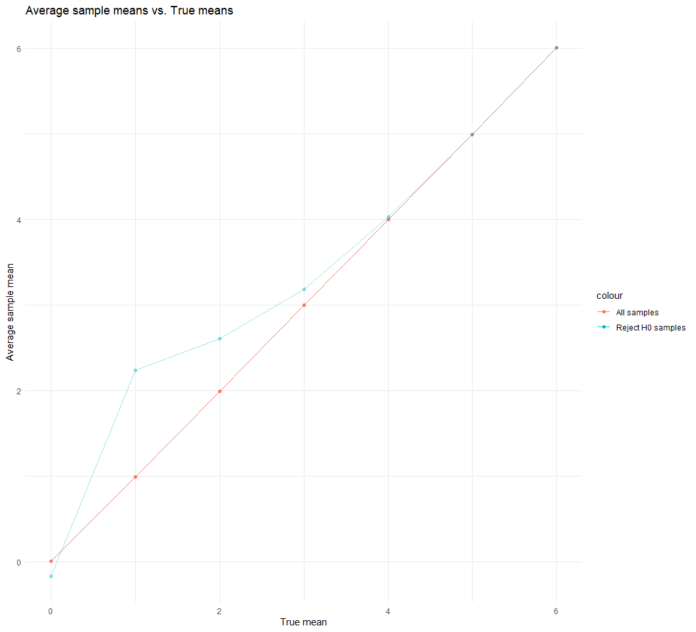

Homework 5
================
Chee Kay Cheong

# Problem 1

Create a list to read and store all the csv files located in the *Data*
folder.

``` r
# I first create a directory that contains the path to all the csv files stored in the Data folder.
Data = "C:/Users/Chu Chu/Desktop/R/Homework/HW5/Problem 1 Data/"

# Then I create a list that will contain all the csv file from the Data folder.
study_list = 
  Data %>% 
  # The "dir_ls" function returns filenames as a named fs_path character vector. 
  # The names are equivalent to the values, which is useful for passing onto functions like purrr::map_df().
  dir_ls() %>% 
  map(
    # Then, map a function that will read csv files.
    .f = function(path) {
      read_csv(path)
    }
  )
```

Create a single dataframe that combines all data in each csv files.

``` r
# I create a dataframe that read the list of csv files and bind all the rows into one dataframe.
long_study = 
  study_list %>% 
  # "set_names" allows R to show all the columns and values from the list of csv files.
  set_names(dir_ls(Data)) %>% 
  # Then, bind all of them together to make one tidy dataframe.
  bind_rows(.id = "file_path") %>% 
  # Create two variables "arm" & "subject_ID" for each observation.
  mutate(
    arm = str_replace(file_path, "^C:/Users/Chu Chu/Desktop/R/Homework/HW5/Problem 1 Data/", ""),
    arm = str_replace(arm, ".csv$", "")) %>% 
    separate(arm, c('arm', 'subject_ID')) %>% 
  select(arm, subject_ID, week_1:week_8, -file_path) %>% 
  # pivot_longer so we can do some analysis later
  pivot_longer(
    week_1:week_8,
    names_to = "week",
    values_to = "observations",
    names_prefix = "week_")

long_study
```

    ## # A tibble: 160 × 4
    ##    arm   subject_ID week  observations
    ##    <chr> <chr>      <chr>        <dbl>
    ##  1 con   01         1             0.2 
    ##  2 con   01         2            -1.31
    ##  3 con   01         3             0.66
    ##  4 con   01         4             1.96
    ##  5 con   01         5             0.23
    ##  6 con   01         6             1.09
    ##  7 con   01         7             0.05
    ##  8 con   01         8             1.94
    ##  9 con   02         1             1.13
    ## 10 con   02         2            -0.88
    ## # … with 150 more rows

``` r
long_study %>% 
  group_by(arm, subject_ID) %>% 
  summarize(
    n_obs = n())
```

    ## # A tibble: 20 × 3
    ## # Groups:   arm [2]
    ##    arm   subject_ID n_obs
    ##    <chr> <chr>      <int>
    ##  1 con   01             8
    ##  2 con   02             8
    ##  3 con   03             8
    ##  4 con   04             8
    ##  5 con   05             8
    ##  6 con   06             8
    ##  7 con   07             8
    ##  8 con   08             8
    ##  9 con   09             8
    ## 10 con   10             8
    ## 11 exp   01             8
    ## 12 exp   02             8
    ## 13 exp   03             8
    ## 14 exp   04             8
    ## 15 exp   05             8
    ## 16 exp   06             8
    ## 17 exp   07             8
    ## 18 exp   08             8
    ## 19 exp   09             8
    ## 20 exp   10             8

The `long_study` dataset contains 2 arms (experimental & control). Each
arm contains 10 subjects, and each subject contributes 8 observations
over the period of 8 weeks (1 observation per week for each subject).

Everything looks fine and data are cleaned, but I don’t understand what
the values under `observations` are representing.

``` r
Arms_name = c(
  `con` = "Control",
  `exp` = "Experimental")

long_study %>% 
  ggplot(aes(x = week, y = observations, group = subject_ID, color = subject_ID)) +
  geom_line() + 
  stat_summary(aes(group = 1), geom = "point", fun.y = mean, shape = 17, size = 3) +
  facet_grid( . ~ arm, labeller = as_labeller(Arms_name)) +
  labs(
    x = "Week",
    y = "Observations",
    title = "Observations over time graph") +
  theme_minimal() + theme(legend.position = "bottom")
```


Based on the spaghetti plot, the overall observations over 8 weeks of
time are higher in the experimental group when comparing to the control
group.

In the experimental group, the mean observations are increasing with
time, whereas the mean observations in the control group do not have
much changes with time.

# Problem 2

##### Raw data

``` r
homicide_raw = read_csv("./Data/homicide_data.csv") 
```

The raw dataset `homicide_raw` consists of 12 variables (*uid,
reported_date, victim_last, victim_first, victim_race, victim_age,
victim_sex, city, state, lat, lon, disposition*) and 52179
observations.  
Missing observations in the latitude `lat` and longitude `lon` columns
are identified as `NA`, while all other columns have some `Unknown`
observations.  
Most variables are character vectors, except for `reported_date`, `lat`,
and `lon`, which are numeric vector.  
I noticed that the dates are recorded in *yyyymmdd* format, which are
not in typical date format and are not arranged in sequence. Besides,
`victim_age` has been identified as character vector due to several
`Unknown` under the column.

Therefore, I would convert the `reported_date` to a nice date format and
convert the `victim_age` variable into a numeric vector.

##### Cleaned data

``` r
homicides =
  homicide_raw%>% 
  janitor::clean_names() %>% 
  mutate(
    victim_age = str_replace(victim_age, "Unknown", "NA"),
    victim_age = as.numeric(victim_age),
    reported_date = as.character(reported_date),
    reported_date = as.Date(reported_date, format = "%Y%m%d"),
    state = ifelse(city == "Tulsa", "OK", state),
    state = str_replace(state, "w", "W")) %>%
  unite(col = 'city_state', c('city', 'state'), sep = ', ')
```

##### Number of homicides & number of unsolved homicides in 50 cities

The table below shows the number of homicides and the number of unsolved
homicides in each city.

``` r
homicides %>% 
  group_by(city_state) %>% 
  summarize(
    n_case = n(),
    n_unsolved = sum(disposition %in% c("Closed without arrest", "Open/No arrest"))) %>% 
  knitr::kable()
```

| city_state         | n_case | n_unsolved |
|:-------------------|-------:|-----------:|
| Albuquerque, NM    |    378 |        146 |
| Atlanta, GA        |    973 |        373 |
| Baltimore, MD      |   2827 |       1825 |
| Baton Rouge, LA    |    424 |        196 |
| Birmingham, AL     |    800 |        347 |
| Boston, MA         |    614 |        310 |
| Buffalo, NY        |    521 |        319 |
| Charlotte, NC      |    687 |        206 |
| Chicago, IL        |   5535 |       4073 |
| Cincinnati, OH     |    694 |        309 |
| Columbus, OH       |   1084 |        575 |
| Dallas, TX         |   1567 |        754 |
| Denver, CO         |    312 |        169 |
| Detroit, MI        |   2519 |       1482 |
| Durham, NC         |    276 |        101 |
| Fort Worth, TX     |    549 |        255 |
| Fresno, CA         |    487 |        169 |
| Houston, TX        |   2942 |       1493 |
| Indianapolis, IN   |   1322 |        594 |
| Jacksonville, FL   |   1168 |        597 |
| Kansas City, MO    |   1190 |        486 |
| Las Vegas, NV      |   1381 |        572 |
| Long Beach, CA     |    378 |        156 |
| Los Angeles, CA    |   2257 |       1106 |
| Louisville, KY     |    576 |        261 |
| Memphis, TN        |   1514 |        483 |
| Miami, FL          |    744 |        450 |
| Milwaukee, WI      |   1115 |        403 |
| Minneapolis, MN    |    366 |        187 |
| Nashville, TN      |    767 |        278 |
| New Orleans, LA    |   1434 |        930 |
| New York, NY       |    627 |        243 |
| Oakland, CA        |    947 |        508 |
| Oklahoma City, OK  |    672 |        326 |
| Omaha, NE          |    409 |        169 |
| Philadelphia, PA   |   3037 |       1360 |
| Phoenix, AZ        |    914 |        504 |
| Pittsburgh, PA     |    631 |        337 |
| Richmond, VA       |    429 |        113 |
| Sacramento, CA     |    376 |        139 |
| San Antonio, TX    |    833 |        357 |
| San Bernardino, CA |    275 |        170 |
| San Diego, CA      |    461 |        175 |
| San Francisco, CA  |    663 |        336 |
| Savannah, GA       |    246 |        115 |
| St. Louis, MO      |   1677 |        905 |
| Stockton, CA       |    444 |        266 |
| Tampa, FL          |    208 |         95 |
| Tulsa, OK          |    584 |        193 |
| Washington, DC     |   1345 |        589 |

From the output, I noticed that there was an error in the `homicides`
dataset. There is a `city_state` named *Tulsa, Alabama* that has only 1
case of homicide but has 0 case of unsolved homicide. I googled and
checked if there is a city named *Tulsa* in *Alabama*. I found that
there is only one place named *Tulsa* in America, and that is in
*Oklahoma*. Hence, I am pretty sure that there is an error in the data
and decided to fix that error by changing `Tulsa, AL` to `Tulsa, OK`.

I also noticed another minor issue with the dataset from the table
above - `Milwaukee, wI`. Although it probably is not a big issue, but to
keep my dataset nice and tidy, I decided to make the lowercase “w” to
uppercase “W”.

I will make all the changes in the code chunk named `clean dataset`
above, so I am not repeating the codes and starting another code chunk.

##### Baltimore

``` r
Baltimore = 
  homicides %>% 
  filter(city_state == "Baltimore, MD") %>% 
  group_by(city_state) %>% 
  summarize(
    n_case = n(),
    n_unsolved = sum(disposition %in% c("Closed without arrest", "Open/No arrest")))

x_balti = Baltimore %>% pull(n_unsolved)

n_balti = Baltimore %>% pull(n_case)

list_baltimore = 
  prop.test(x_balti, n_balti) %>% 
  broom::tidy()

Baltimore_stat = 
  bind_cols(Baltimore, list_baltimore)

Baltimore_stat %>% 
  select(city_state, n_case, n_unsolved, estimate, conf.low, conf.high) %>% 
  knitr::kable()
```

| city_state    | n_case | n_unsolved |  estimate |  conf.low | conf.high |
|:--------------|-------:|-----------:|----------:|----------:|----------:|
| Baltimore, MD |   2827 |       1825 | 0.6455607 | 0.6275625 | 0.6631599 |

In Baltimore, MD, it is estimated that **64.56%** of homicides remained
unsolved. We are 95% confident that the proportion of unsolved homicides
in Baltimore, MD lies between *62.76%* and *66.32%*.

##### All cities

``` r
all_cities = 
  homicides %>% 
  group_by(city_state) %>% 
  summarize(
    n_case = n(),
    n_unsolved = sum(disposition %in% c("Closed without arrest", "Open/No arrest"))) %>% 
  nest(data = n_case:n_unsolved)
```

``` r
prop_unsolved = function(df) {

  x = df %>% pull(n_unsolved)
  
  n = df %>% pull(n_case)
  
  results = 
    prop.test(x, n) %>% 
    broom::tidy()

  result_stat = 
    bind_cols(df, results)

  result_stat %>% 
    select(estimate, conf.low, conf.high)
  
}
```

``` r
all_cities_stat = 
  all_cities %>% 
  mutate(
    map_df(all_cities[["data"]], prop_unsolved)) %>% 
  unnest(data)

all_cities_stat
```

    ## # A tibble: 50 × 6
    ##    city_state      n_case n_unsolved estimate conf.low conf.high
    ##    <chr>            <int>      <int>    <dbl>    <dbl>     <dbl>
    ##  1 Albuquerque, NM    378        146    0.386    0.337     0.438
    ##  2 Atlanta, GA        973        373    0.383    0.353     0.415
    ##  3 Baltimore, MD     2827       1825    0.646    0.628     0.663
    ##  4 Baton Rouge, LA    424        196    0.462    0.414     0.511
    ##  5 Birmingham, AL     800        347    0.434    0.399     0.469
    ##  6 Boston, MA         614        310    0.505    0.465     0.545
    ##  7 Buffalo, NY        521        319    0.612    0.569     0.654
    ##  8 Charlotte, NC      687        206    0.300    0.266     0.336
    ##  9 Chicago, IL       5535       4073    0.736    0.724     0.747
    ## 10 Cincinnati, OH     694        309    0.445    0.408     0.483
    ## # … with 40 more rows

##### Create a plot

Create a plot that shows the estimated proportion of unsolved homicides
and their corresponding 95% confidence intervals for each city.

``` r
all_cities_stat %>% 
  mutate(city_state = fct_reorder(city_state, estimate)) %>% 
  ggplot(aes(x = estimate, y = city_state, fill = city_state)) +
  geom_bar(stat="identity") +
  geom_errorbar(aes(xmin = conf.low, xmax = conf.high), width = 0.5) +
  labs(
    x = "Proportion of unsolved homicide",
    y = "City, State",
    title = "Proportion of unsolved homicide with 95% CI in 50 major cities in the US") +
  theme_minimal() +
  theme(legend.position = "none")
```


# Problem 3

Create a list of 5000 dataframes, which each of them is comprised of 30
random numbers that follow a normal distribution of mean = 0 and
standard deviation = 5.

``` r
first_set = vector(mode = 'list', length = 5000)
  n = 5000
  for (i in 1:n) {
    first_set[[i]] = rnorm(30, 0, 5)
  }
```

Create a function to obtain the estimated mean of each sample and their
corresponding p-value.

``` r
samp_mean_p = function(x) {
  
  samp_results = t.test(x, mu = 0) %>% 
    broom::tidy() %>% 
    select(estimate, p.value) %>% 
    rename(
      mean_hat = estimate,
      p_value = p.value)
}
```

Apply function to the list and store the output in a nice dataframe.

``` r
first_list_df = 
  tibble(
  sample = first_set)

test_one = map_df(first_set, samp_mean_p)

First_set_tidy = bind_cols(first_list_df, test_one)

First_set_tidy
```

    ## # A tibble: 5,000 × 3
    ##    sample     mean_hat p_value
    ##    <list>        <dbl>   <dbl>
    ##  1 <dbl [30]>    1.62   0.131 
    ##  2 <dbl [30]>   -0.535  0.536 
    ##  3 <dbl [30]>    0.685  0.470 
    ##  4 <dbl [30]>    1.82   0.0642
    ##  5 <dbl [30]>    1.64   0.0179
    ##  6 <dbl [30]>    1.76   0.0893
    ##  7 <dbl [30]>    1.60   0.102 
    ##  8 <dbl [30]>    0.819  0.320 
    ##  9 <dbl [30]>    0.550  0.493 
    ## 10 <dbl [30]>    0.940  0.302 
    ## # … with 4,990 more rows

#### Change the values of true mean

Repeat the above for μ = {1,2,3,4,5,6}. Just in case, we need to include
the one dataframe we created above (true mean = 0). I am going to
include true mean = 0 in the iteration below.

``` r
change_mean = function(mu) {
  
  x = rnorm(30, mu, 5)
  
  samp_results = t.test(x, mu = 0) %>% 
    broom::tidy() %>% 
    select(estimate, p.value) %>% 
    rename(
      mean_hat = estimate,
      p_value = p.value) %>% 
    mutate(
      random_x = list(x),
      sample_size = 30,
      true_sd = 5)
}
```

``` r
multiple_mean = 
  expand_grid(   
    true_mean = c(0, 1, 2, 3, 4, 5, 6), 
    iteration = 1:5000) %>%   
  mutate(
    estimate_measures = map(true_mean, change_mean)) %>% 
  unnest(estimate_measures)

multiple_mean =
  multiple_mean %>% 
  select(random_x, sample_size, true_sd, true_mean, mean_hat, p_value)
```

``` r
multiple_mean %>% 
  group_by(true_mean) %>% 
  summarize(
    prop_reject = sum(p_value < 0.05) / 5000) %>% 
  ggplot(aes(x = true_mean, y = prop_reject)) +
  geom_point() +
  geom_line() + 
  labs(
    x = "True mean",
    y = "Proportion",
    title = "Proportion of rejecting H0 for each sample with different true mean") +
  theme_minimal()
```


``` r
ave_all =
  multiple_mean %>% 
  group_by(true_mean) %>% 
  summarize(
    average_mean_hat = mean(mean_hat))

ave_rej = 
  multiple_mean %>% 
  filter(p_value < 0.05) %>% 
  group_by(true_mean) %>% 
  summarize(
    average_mean_hat = mean(mean_hat))

ggplot(ave_all, aes(x = true_mean, y = average_mean_hat, color = "All samples")) +
  geom_point() +
  geom_line() + 
  geom_line(data = ave_rej, aes(x = true_mean, y = average_mean_hat, color = "Reject H0 samples"), alpha = 0.4) +
  geom_point(data = ave_rej, aes(x = true_mean, y = average_mean_hat, color = "Reject H0 samples"), alpha = 0.4) +
  labs(
    x = "True mean",
    y = "Average sample mean",
    title = "Average sample means vs. True means") +
  theme_minimal()
```


